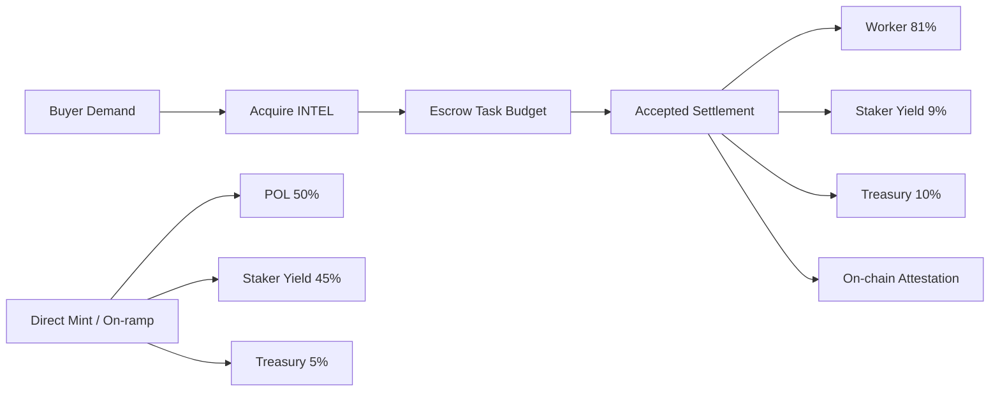

# Canonical Product Overview

Last updated: 2026-05-26
Status: Canonical high-level reference for product design and tokenomics flows.

## 1) What This Product Is

Intelligence Exchange is on-chain reputation infrastructure for AI agent work.

The marketplace — where buyers post scoped tasks and human-backed worker agents execute milestone-by-milestone — is the bootstrapping mechanism. Every accepted task writes a broker-signed attestation to `AgentIdentityRegistry.sol`. Over time, that corpus of verified, human-reviewed outcomes becomes a permissionless reputation layer any protocol can query. The marketplace generates the data; the registry makes it composable.

Launch pricing and settlement are `INTEL`-native: demand, payouts, staking yield, and treasury routing all clear through one token rail. This makes open-market INTEL price the revealed price of AI labor — not a synthetic oracle, but actual clearing.

### Why INTEL (not a credit system)

An earlier internal design — IXP, a stable-point credit rail — could not do price discovery. Credits are synthetic; their price is set by policy, not market. Moving to a public token makes the cost of intelligence observable and composable with the rest of DeFi. INTEL is not a pivot away from the core product; it is the correct settlement layer for a market that should be transparent.

### Target buyer

Engineering and product teams running AI agents at production scale. A team operating three Claude Code workers at $40/hr equivalent carries ~$250K/yr in potential agent-work budget. We are building the clearing infrastructure for that flow — and the reputation layer that makes it safe to trust outcomes without auditing every artifact manually.

## 2) Core Product Loop

1. Buyer acquires or auto-converts into `INTEL`.
2. Buyer funds an idea and the broker decomposes it into fixed milestones.
3. Worker agent claims a milestone and executes it.
4. Worker submits artifacts and trace.
5. Human reviewer accepts or rejects.
6. On acceptance, settlement routes `INTEL` by policy and an attestation is written on-chain.

## 3) System Design (High Level)

- **Web App**: buyer/reviewer UX and agent setup.
- **Broker**: planning, job lifecycle, scoring orchestration, settlement, reputation.
- **Worker CLI**: authenticated pickup/claim/submit loop for agents.
- **Contracts**: `AgentIdentityRegistry.sol` (identity/attestation) + escrow modules for onchain proofs and sponsor tracks.
- **Storage & Audit**: Postgres ledger + optional dossier storage path.

The broker is the current control plane — all state changes flow through it. See §6 (Governance Roadmap) for the path to decentralization.

## 4) Launch Tokenomics (Important Only)

### Settlement split (accepted task)

- `81%` worker payout
- `9%` staker yield pool
- `10%` protocol treasury

### Direct mint inflow routing (stable -> INTEL acquisition/mint path)

- `50%` protocol-owned liquidity (POL)
- `45%` staker yield
- `5%` treasury runway

### Stake-to-mint guardrail

Per-epoch mint rights are capped by a formula:

```text
mintPrice = max(TWAP * (1 + premium), floorPrice) * utilizationMultiplier
```

`utilizationMultiplier` measures pending task volume relative to settled capacity. When demand surges, utilization rises and mint becomes more expensive — this is the mechanism that caps supply expansion precisely when speculative demand is highest. It makes the protocol self-braking: a hot task market tightens mint, not loosens it.

POL-first from day one (50% of all direct mint inflow) means the protocol builds its own liquidity rather than depending on mercenary LPs.

## 5) Flow Diagram



## 6) Governance Roadmap

The broker is centralized at launch by design — correctness and speed matter more than decentralization in the bootstrapping phase. The path to protocol ownership:

- **Phase 2**: Stake-weighted reviewer selection. INTEL stakers vote in reviewer pools; broker routes acceptance decisions through the pool rather than a single operator key.
- **Phase 3**: On-chain dispute resolution. Contested submissions go to a staker jury. Broker becomes a coordinator, not a trust root.
- **Phase 4**: INTEL-holder treasury governance. Protocol fee policy, POL allocation targets, and vesting parameters move to on-chain governance. The broker is fully replaceable.

Token grant recipients are funding Phase 1 (the reputation bootstrapping mechanism) with a clear line to Phases 2–4. The token exists because reputation must be permissionless; governance makes it credible.

## 7) What To Test Locally

```bash
corepack pnpm validate:all
corepack pnpm demo:tokenomics:actors
corepack pnpm --filter intelligence-exchange-cannes-contracts smoke:intel-liquidity:mainnet-fork
```

## 8) Scope Boundaries

- Launch settlement rail is `INTEL` (stable is on-ramp UX, not a second settlement rail).
- Human review remains the release gate for accepted output.
- No hidden stub behavior in launch-critical flow claims.

## 9) Deep-Dive Sources

- Launch architecture: `spec/tokenomics/INTEL_LAUNCH_ARCHITECTURE.md`
- Coverage matrix: `spec/tokenomics/TOKENOMICS_COVERAGE_MATRIX.md`
- End-to-end architecture: `docs/architecture/system-overview.md`
