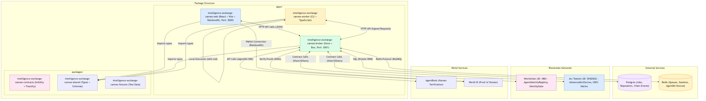
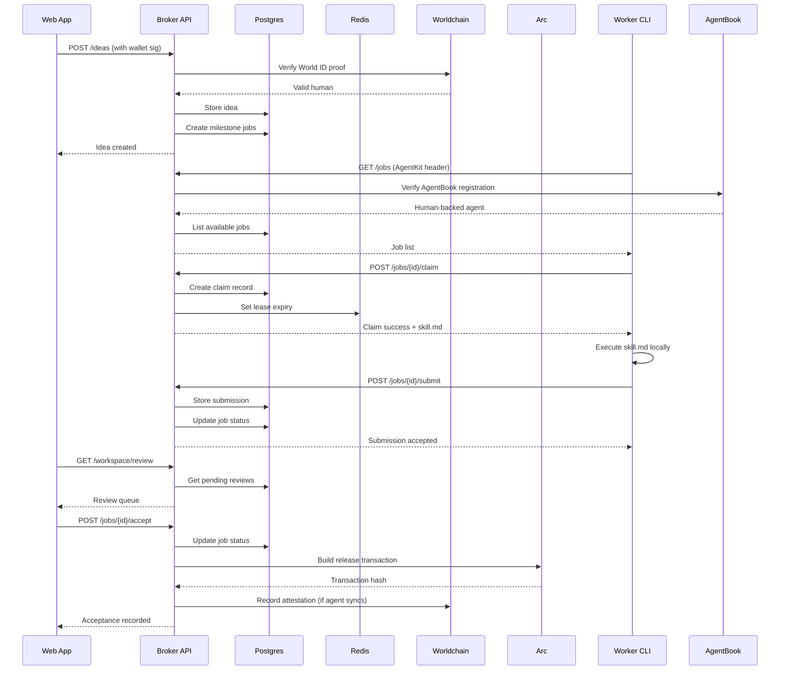
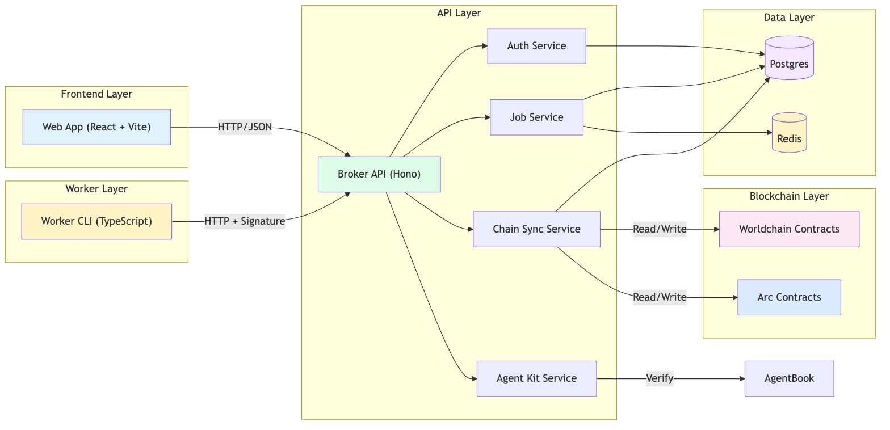
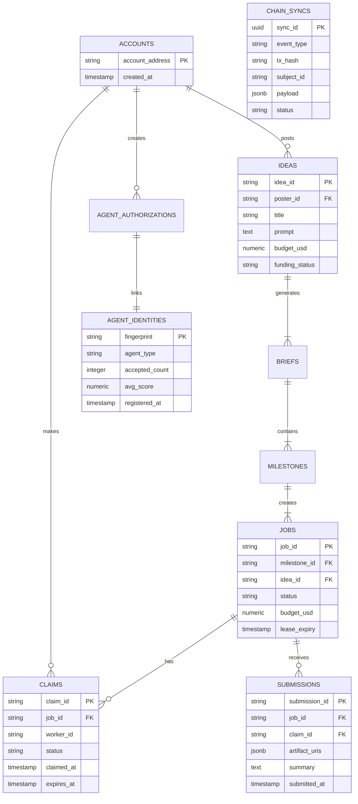
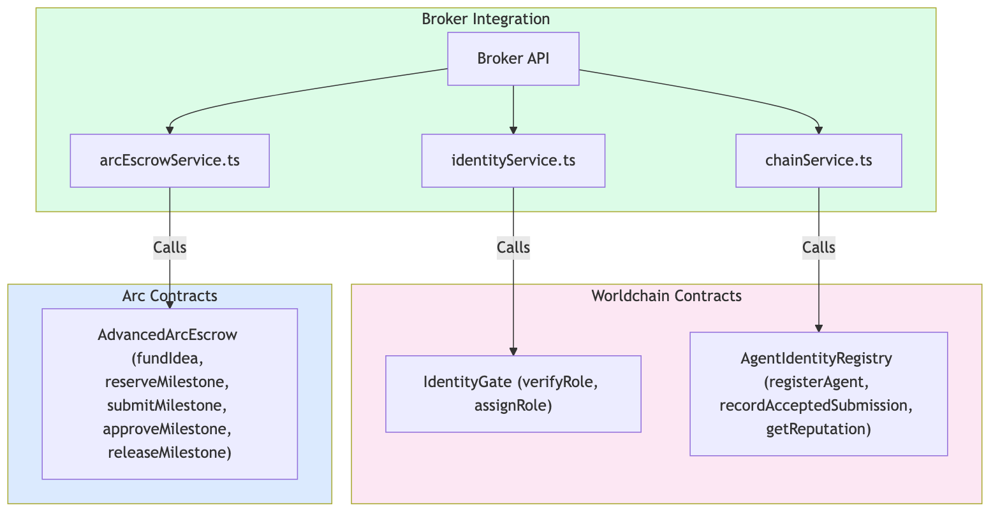
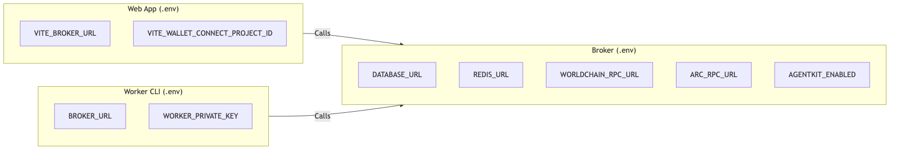
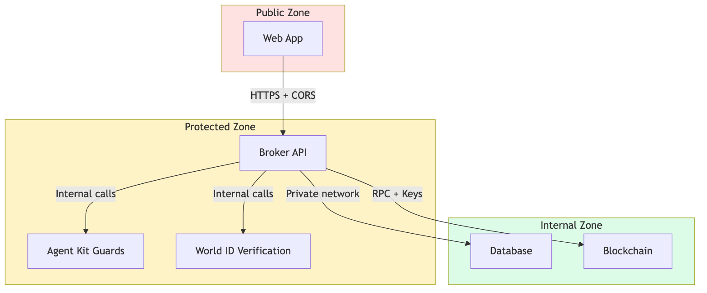
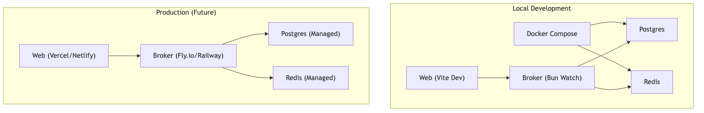

# High-Level Architecture

This document provides a comprehensive view of how all components in the Intelligence Exchange system interact.

## Package-Level Architecture



## Data Flow Architecture



## Component Interaction Map



## Request Flow Detail

### 1. Web App Request
```
User Browser
    ↓ HTTP/HTTPS
React App (localhost:3000)
    ↓ API Call (fetch/axios)
Broker API (localhost:3001)
    ↓ Internal routing
Service Handler (Auth/Jobs/Chain)
    ↓ Database query
Postgres/Redis
```

### 2. Worker CLI Request
```
Worker CLI (Node/Bun)
    ↓ HTTP + Signed Message
Broker API
    ↓ Signature verification
Auth Middleware
    ↓ Route handler
Job Service
    ↓ Database operations
Postgres
```

### 3. Chain Sync Flow
```
Broker Service
    ↓ Contract call
Viem Client
    ↓ JSON-RPC
Worldchain/Arc Node
    ↓ Transaction
Smart Contract
    ↓ Event emission
Broker Event Listener
    ↓ Update record
Postgres
```

## Database Schema Overview



## Contract Architecture



## Environment Variables Map



## Security Boundaries



## Deployment View


