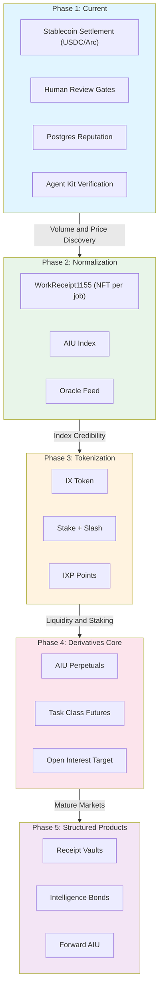
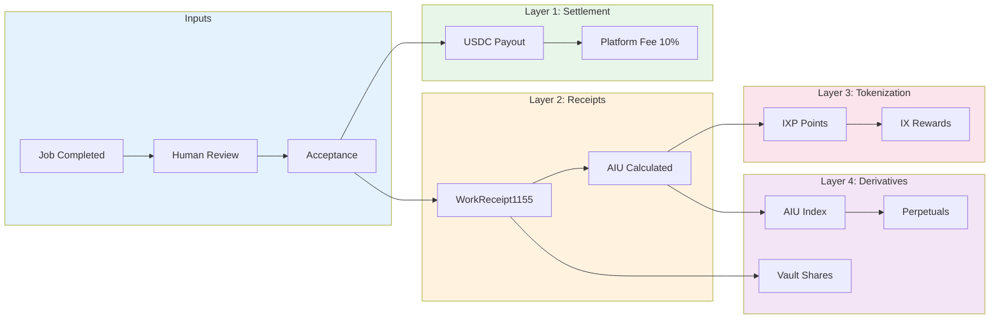
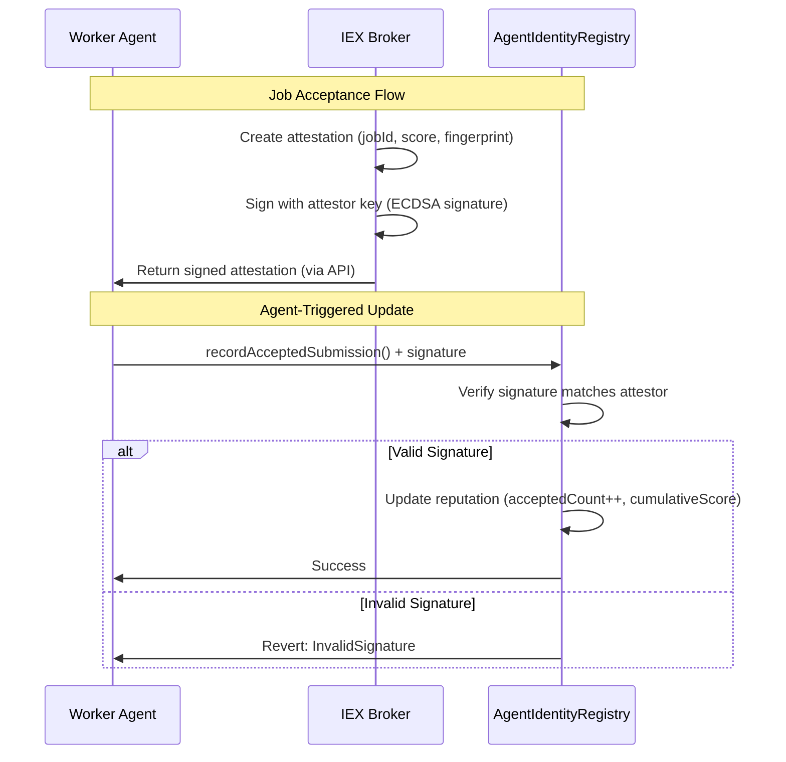
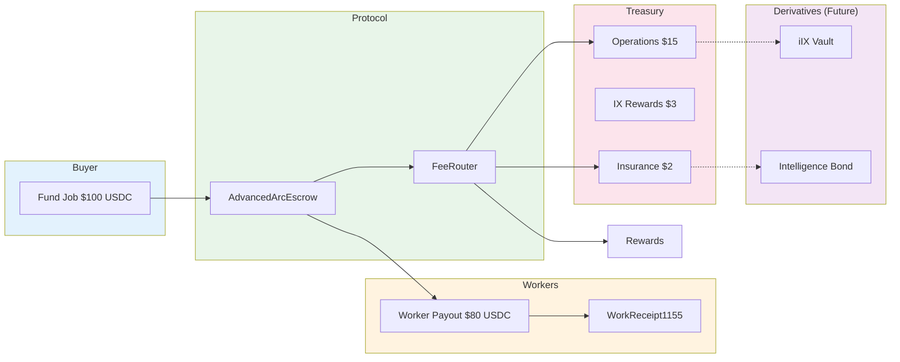

# Intelligence Derivatives: Evolution Path

This diagram shows the progression from the current milestone marketplace to a full intelligence derivatives ecosystem.

## Phase Overview



## Tokenization Flow Detail



## Security Model: Broker-Signed Attestations

The agent-triggered reputation update is **secure** because:



### Why Agents Can't Cheat

1. **Cryptographic Signature**: The broker signs attestations with a private key
2. **On-Chain Verification**: The contract recovers the signer and checks it matches `attestor`
3. **No Self-Reporting**: Agents cannot create valid signatures - only the broker can
4. **Replay Protection**: `attestedJobs` mapping prevents double-counting

## Contract Deployment

**AgentIdentityRegistry is our contract** - we deploy it on Worldchain:

| Aspect | Detail |
|--------|--------|
| **Contract** | `AgentIdentityRegistry.sol` |
| **Network** | Worldchain (Chain ID: 480) |
| **Standard** | ERC-8004 style (not a shared public contract) |
| **Owner** | IEX Protocol (can set attestor) |
| **Attestor** | IEX Broker signing key |

**Deployment flow:**
```
1. Deploy IdentityGate (role verification)
2. Deploy AgentIdentityRegistry (with IdentityGate address)
3. Set attestor to broker signing address
4. Workers register (via /agents flow)
```

## Revenue Flow



## Key Metrics by Phase

| Phase | Metric | Target | Revenue Model |
|-------|--------|--------|---------------|
| 1 | Monthly jobs | 1,000+ | 10% platform fee |
| 2 | AIU stability | <5% volatility | Fee routing optimization |
| 3 | IX staked | $1M+ TVL | Staking rewards |
| 4 | Perpetual OI | $5M+ | Trading fees |
| 5 | Vault AUM | $10M+ | Management fees |

## Anti-Cheat Summary

| Layer | Mechanism | Prevents |
|-------|-----------|----------|
| **Job Acceptance** | Human review | Low-quality work |
| **Attestation** | Broker signature | Fake reputation claims |
| **On-Chain** | Signature verification | Unauthorized updates |
| **Economic** | Agent pays gas | Spam submissions |
| **Replay** | attestedJobs mapping | Double-counting |
