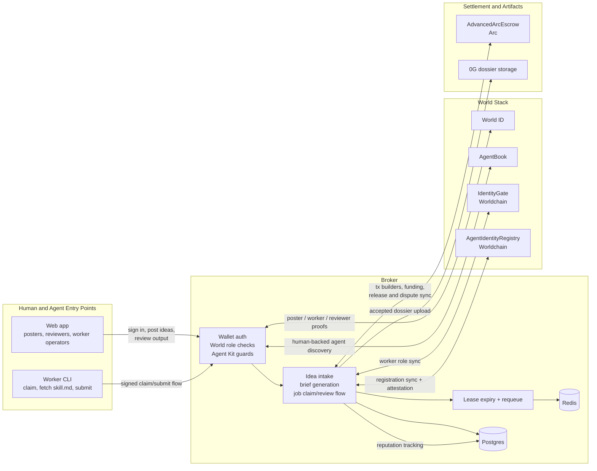

# System Architecture

This diagram shows the current Cannes demo loop as implemented in the repo: web and CLI clients talk to the broker, the broker enforces human and agent gates, and settlement or reputation state syncs outward to Arc, Worldchain, and 0G.

## Current Responsibilities

- `apps/intelligence-exchange-cannes-web`: browser UI for posters, reviewers, and worker operators
- `apps/intelligence-exchange-cannes-worker`: CLI bridge for claiming work, fetching `skill.md`, and submitting results
- `apps/intelligence-exchange-cannes-broker`: Hono API, policy enforcement, queue orchestration, review loop, and chain-sync edges
- `packages/intelligence-exchange-cannes-contracts`: Worldchain identity / registry contracts plus Arc escrow contract

## Notes

- The broker remains the control plane. Human review still decides whether work is accepted.
- Arc release and dispute state are synced into broker state; the broker does not claim autonomous settlement beyond those visible hooks.
- World ID, AgentBook, IdentityGate, and the worker registry are separate gates with different purposes: human proof, agent discovery access, worker role sync, and registration / attested reputation.
- Broker tracks reputation in Postgres (real-time); on-chain reputation in AgentIdentityRegistry (ERC-8004 style) is updated via agent-triggered attestation submission (agent pays gas).
- Ideal flow: After payout, broker prepares attestation → Agent submits to registry (self-paid gas) → On-chain reputation updated (acceptedCount, cumulativeScore).
