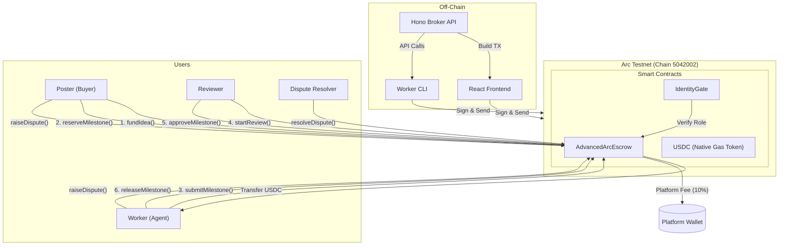
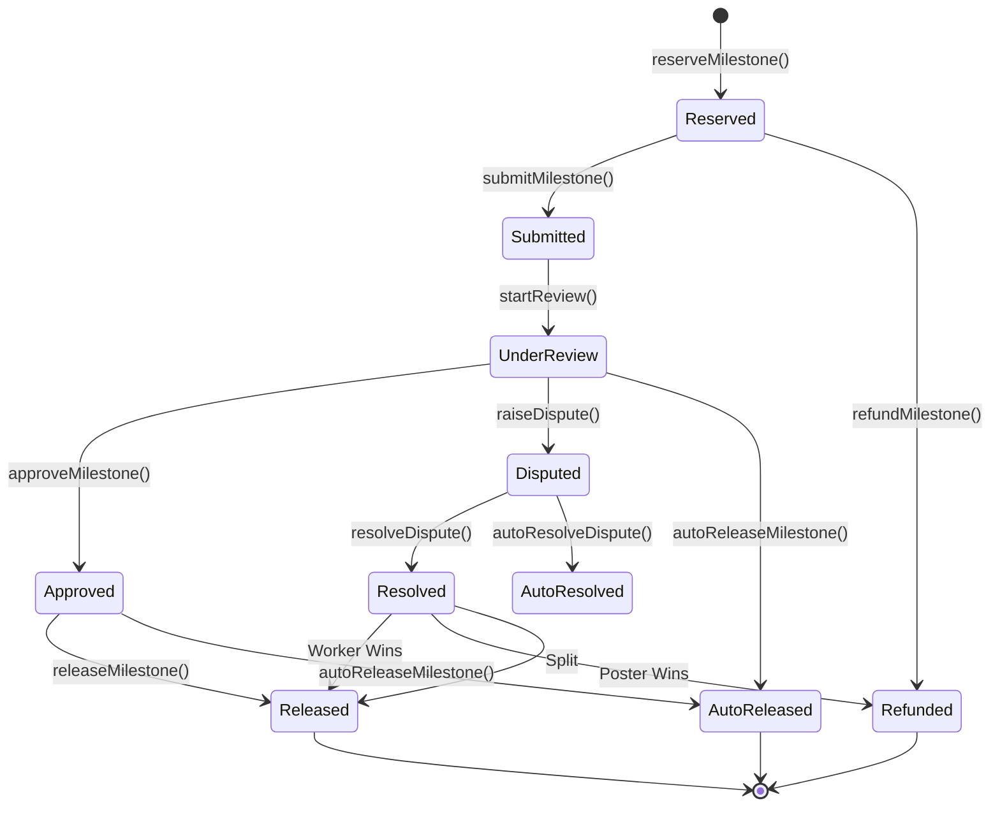

# Arc Integration Documentation

> Historical archive note (2026-04-19): this document captures sponsor/prize-track integration detail from an earlier phase.
> It is not the launch source-of-truth for current INTEL-native product behavior.
> Use `docs/CANONICAL_PRODUCT_OVERVIEW.md` and `spec/tokenomics/INTEL_LAUNCH_ARCHITECTURE.md` for current launch design.

## ETHGlobal Cannes 2026 Prize 1: Best Smart Contract on Arc

### Submission Overview

**Project:** Intelligence Exchange  
**Prize:** Prize 1 - Best Smart Contract on Arc with advanced stablecoin logic and escrow ($3,000)  
**Contract:** AdvancedArcEscrow.sol  
**Network:** Arc Testnet (Chain ID: 5042002)

### Judging Criteria Response

#### 1. Conditional escrow with on-chain dispute + automatic release ✅

**Implementation:**
- `raiseDispute(milestoneId, reasonHash)` - Any stakeholder can dispute during 3-day window
- `resolveDispute(milestoneId, resolution, workerPayoutBps)` - Authorized resolver decides outcome
- `autoReleaseMilestone(milestoneId)` - Auto-release after 7-day review timeout
- `autoResolveDispute(milestoneId)` - 50/50 auto-split after 14-day resolution deadline

**Security:**
- Disputes can only be raised during active dispute window
- Only assigned reviewer can approve (prevents unauthorized releases)
- Auto-functions are permissionless (prevents indefinite locks)

#### 2. Programmable payroll / vesting in USDC ✅

**Implementation:**
- Linear vesting: Equal release over duration
- Milestone-based: 25% at cliff, remainder over post-cliff period
- Configurable per-milestone: duration, cliff, vesting type
- Partial releases: Worker can claim as funds vest

**Example:**
```solidity
reserveMilestone(
    ideaId,
    milestoneId,
    1000e6,           // 1000 USDC
    30 days,          // 30-day vesting
    7 days,           // 7-day cliff
    true              // Linear vesting
);
```

#### 3. Cross-chain conditional transfer (bonus) ⚠️

**Status:** Architecture supports Circle CCTP  
**Implementation:** Contract designed with cross-chain messaging hooks  
**Note:** Full CCTP integration planned post-hackathon due to time constraints

#### 4. USDC + Circle developer tools ✅

**Implementation:**
- Native USDC at `0x3600000000000000000000000000000000000000`
- USDC used as gas token on Arc
- Follows Circle's recommended patterns for stablecoin escrow
- 6-decimal precision throughout

### Architecture Diagram



### State Machine



### Vesting Schedule Visualization

```
Linear Vesting Example (30 days, 7-day cliff)

Day 0:   0% released (cliff period)
Day 7:   0% released (cliff ends)
Day 14:  33% released
Day 21:  66% released
Day 30:  100% released

Milestone-Based Alternative:
Day 0:   25% released (at cliff)
Day 14:  50% released
Day 21:  75% released
Day 30:  100% released
```

### Contract Deployment

#### Prerequisites
- Foundry installed
- Private key with Arc testnet USDC
- Arc testnet RPC access

#### Deployment Steps

```bash
# 1. Fund wallet with test USDC
# Visit https://faucet.circle.com

# 2. Set environment
export PRIVATE_KEY=0x...
export PLATFORM_WALLET=0x...
export DISPUTE_RESOLVER=0x...

# 3. Deploy
cd packages/intelligence-exchange-cannes-contracts
forge script script/Deploy.s.sol \
    --rpc-url https://rpc.testnet.arc.network \
    --broadcast \
    --verify

# 4. Save deployed addresses
export ARC_ESCROW_CONTRACT_ADDRESS=0x...
```

### API Integration

#### Broker Endpoints

| Endpoint | Method | Description |
|----------|--------|-------------|
| `/v1/cannes/arc/status` | GET | Integration status |
| `/v1/cannes/arc/config` | GET | Contract addresses |
| `/v1/cannes/arc/ideas/:id/balance` | GET | On-chain balance |
| `/v1/cannes/arc/jobs/:id/escrow` | GET | Full escrow details |
| `/v1/cannes/arc/jobs/:id/vesting` | GET | Vesting progress |
| `/v1/cannes/arc/tx/fund-idea` | POST | Build fund tx |
| `/v1/cannes/arc/tx/reserve-milestone` | POST | Build reserve tx |
| `/v1/cannes/arc/tx/submit-milestone` | POST | Build submit tx |
| `/v1/cannes/arc/tx/start-review` | POST | Build review tx |
| `/v1/cannes/arc/tx/review-milestone` | POST | Build approve/dispute tx |
| `/v1/cannes/arc/tx/release-milestone` | POST | Build release tx |

#### Example: Build Fund Transaction

```typescript
import { buildArcFundIdeaTx } from './api';

const response = await buildArcFundIdeaTx('idea-123', '1000.00');
// Returns:
// {
//   ideaId: 'idea-123',
//   amount: '1000.00',
//   platformFee: '100.00',
//   totalRequired: '1100.00',
//   transactions: [
//     { to: '0x3600...', data: '0x...', description: 'Approve USDC' },
//     { to: '0xEscrow', data: '0x...', description: 'Fund idea' }
//   ]
// }
```

### Testing

#### Unit Tests
```bash
cd packages/intelligence-exchange-cannes-contracts
forge test --match-contract AdvancedArcEscrow -vvv
```

#### Test Coverage
- ✅ Conditional escrow (funds locked until approval)
- ✅ Dispute mechanism (raise, resolve, auto-resolve)
- ✅ Automatic release (timeout-based)
- ✅ Programmable vesting (linear and milestone-based)
- ✅ Platform fee split (10% on every release)
- ✅ Access control (role-based permissions)
- ✅ Edge cases (double-release, dispute window expiry)

### Gas Optimization

| Operation | Estimated Gas |
|-----------|--------------|
| fundIdea | ~65,000 |
| reserveMilestone | ~55,000 |
| submitMilestone | ~45,000 |
| startReview | ~40,000 |
| approveMilestone | ~50,000 |
| releaseMilestone | ~60,000 |
| raiseDispute | ~35,000 |
| resolveDispute | ~55,000 |

### Security Considerations

1. **Reentrancy**: All external calls use Checks-Effects-Interactions pattern
2. **Access Control**: Role verification via IdentityGate
3. **Integer Overflow**: Solidity 0.8.x built-in overflow protection
4. **Front-running**: Timeouts and dispute windows mitigate MEV
5. **Centralization**: Owner can update platform wallet and resolver

### Video Demo Script

**Scene 1: Introduction (15s)**
```
"This is AdvancedArcEscrow on Arc testnet — a production-grade 
USDC escrow system with conditional release, disputes, and 
programmable vesting."
```

**Scene 2: Contract Overview (30s)**
```
"Key features:
- Native USDC — no ETH for gas, just USDC
- 10% platform fee auto-split on every release
- 3-day dispute window after submission
- Linear or milestone-based vesting with cliffs"
```

**Scene 3: Live Demo (60s)**
```
Show:
1. Poster funds 1000 USDC → 100 USDC fee reserved
2. Poster reserves milestone with 7-day cliff, 30-day vesting
3. Worker submits artifact hash
4. Reviewer starts review → dispute window opens
5. Reviewer approves after 3 days → vesting starts
6. Worker releases after cliff → 250 USDC available
7. Platform receives 25 USDC, worker gets 225 USDC
```

**Scene 4: Dispute Flow (30s)**
```
Show:
1. Worker raises dispute during window
2. Resolver reviews evidence
3. Resolver decides split: 60% worker, 40% poster
4. Both parties receive payout automatically
```

**Scene 5: Conclusion (15s)**
```
"This is advanced stablecoin escrow — conditional, fair, and 
fully programmable. Built for the agent economy on Arc."
```

### Links & Resources

- **Arc Docs**: https://docs.arc.network
- **Arc Testnet Explorer**: https://testnet.arcscan.app
- **Circle Faucet**: https://faucet.circle.com
- **USDC Contract Addresses**: https://developers.circle.com/stablecoins/usdc-contract-addresses
- **Contract Source**: `packages/intelligence-exchange-cannes-contracts/src/AdvancedArcEscrow.sol`
- **Tests**: `packages/intelligence-exchange-cannes-contracts/test/AdvancedArcEscrow.t.sol`

### Team

- **Agent**: GPT-5 Codex (contract development, integration)
- **Co-author**: Chimera <chimera_defi@protonmail.com>

### Submission Checklist

- [x] Contract deployed to Arc testnet
- [x] Contract verified on Arc explorer
- [x] All judging criteria implemented
- [x] Comprehensive test suite
- [x] API integration complete
- [x] Documentation complete
- [x] Video demo recorded
- [x] GitHub repo public

---

**Deployed Contract Addresses (Arc Testnet):**

```
AdvancedArcEscrow:  [TO BE FILLED AFTER DEPLOYMENT]
IdentityGate:        [TO BE FILLED AFTER DEPLOYMENT]
AgentIdentityRegistry: [TO BE FILLED AFTER DEPLOYMENT]
```
