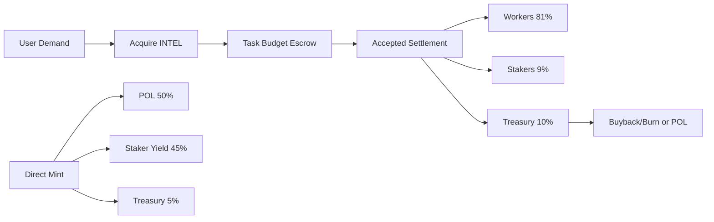

## TOKENOMICS (INTEL-Native Launch Spec)

Last updated: 2026-04-18

## Product Reset

This is a launch spec for a new product direction, not a migration plan.

- `INTEL` is the primary pricing and settlement unit.
- Stable rails are optional on-ramp UX only.
- Legacy stable-point accounting and Arc-first settlement are out of launch scope.

## Launch Principles

1. Single monetary rail for task pricing and settlement.
2. Open-market token price as the intelligence price-discovery engine.
3. Yield and treasury flows must be tied to real accepted-task demand.
4. Economic controls first; avoid heavy gating in core product loops.

## Launch Mechanics

### Task Settlement

Buyer acquires `INTEL`, escrows task budget, and accepted settlement splits:

```text
workerPayout = grossIntel * 0.81
stakerYield = grossIntel * 0.09
treasury = grossIntel * 0.10
```

### Staking + Mint

Stake `INTEL` for mint rights and yield participation:

```text
allowancePerEpoch(wallet) = min(k * sqrt(stakedIntel(wallet)), walletCap, globalCapRemaining)
mintPrice = max(TWAP * (1 + premium), floorPrice) * utilizationMultiplier
```

### Mint Inflow Routing

```text
protocolOwnedLiquidity = stableInflow * 0.50
stakerYield = stableInflow * 0.45
treasury = stableInflow * 0.05
```

## Sources and Sinks

### Sources

- Market buys
- Direct mint (bounded by caps + pricing controls)
- Worker payouts from accepted tasks

### Sinks

- Task escrow/settlement
- Staking locks
- Buyback-and-burn policy

## Blind Spots and Controls

1. Reflexive mint loop.
   - Control: strict epoch caps and utilization premiums.
2. Thin-liquidity manipulation.
   - Control: TWAP windows, mint floor, and slippage clamps.
3. Demandless emissions.
   - Control: emissions keyed to accepted-task volume.
4. Worker sell pressure shocks.
   - Control: optional vesting tiers and performance multipliers.
5. Mercenary staking churn.
   - Control: cooldown and time-weighted rewards.

## Hard Launch Constraints

1. No stable-denominated settlement in user-facing flows.
2. No IXP/legacy credit terminology in launch UX.
3. No Arc escrow dependency in the launch critical path.
4. No mandatory identity gate for core task posting/claiming.
5. Full-budget settlement or fail; no silent partial payout.

## Architecture Snapshot



Detailed launch architecture:

- `spec/tokenomics/INTEL_LAUNCH_ARCHITECTURE.md`
