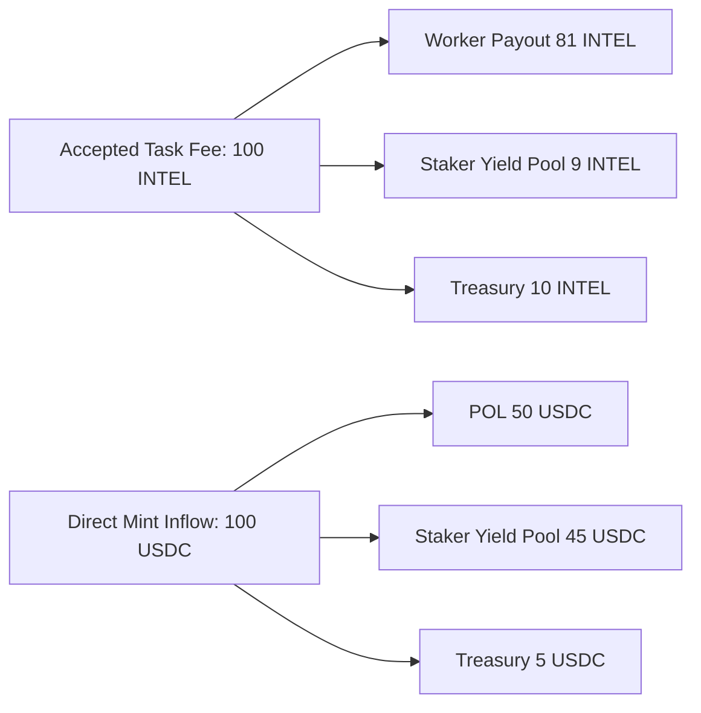
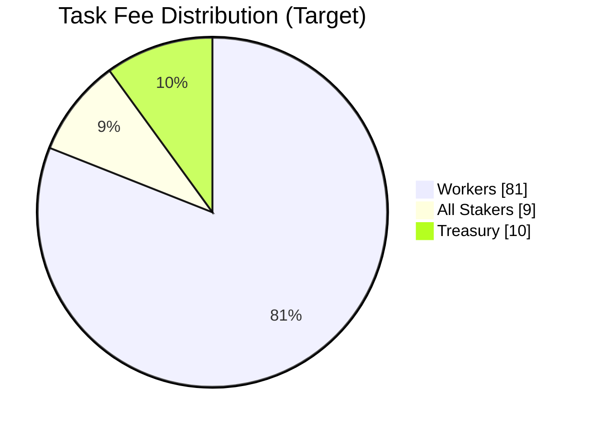
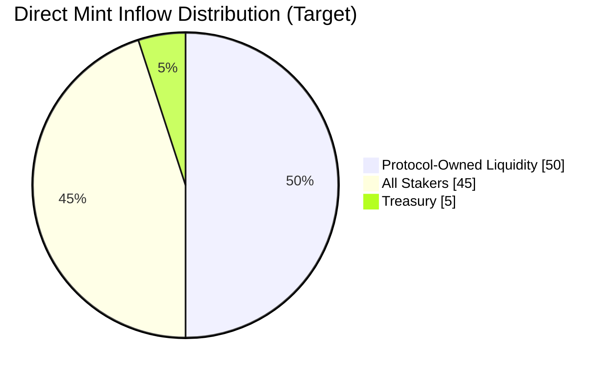

## TOKENOMICS (Implemented + Design Update)

### Executive Summary (Living)

Last updated: 2026-04-18

| Area | Status | Canonical Behavior |
|---|---|---|
| Stable-funded mint + settlement | Implemented | Stable funding mints internal `IXP`; acceptance settles `IXP` with ledger accounting |
| Task payment rail | Designed next | `INTEL` becomes the single payment rail for task settlement |
| Stake-to-mint allowance | Designed next | Staking grants epoch-capped mint rights with TWAP-anchored pricing |
| Yield recipients | Designed next | Staker distributions are pro-rata across all stakers |
| Public market path | Designed next | Speculative roadmap in `spec/tokenomics/PUBLIC_MARKET_PATH.md` |

This spec intentionally separates shipped behavior from design direction so the demo remains honest while we iterate toward the token plan.

### Implemented Today: Broker `IXP` Loop

Scope in production broker:

- Funding unit: stable-denominated USD amount at idea funding time
- Execution accounting unit: internal `IXP` credits
- Settlement trigger: human reviewer acceptance
- Public transferable token launch: out of scope for current build

Pricing engine implementation lives in `packages/intelligence-exchange-cannes-tokenomics`.

```text
curvePrice = basePriceUsdPerIxp * exp(adjustmentPower * (currentSupplyIxp / targetSupplyIxp)^3)
effectivePrice = curvePrice * (1 + (stableAmountUsd / liquidityDepthUsd) * (slippageBps / 10_000))
mintedIxp = stableAmountUsd / effectivePrice
```

Acceptance-time settlement steps:

1. Read idea reserve and average mint price.
2. Convert job budget USD to required gross `IXP`.
3. Split gross `IXP` into worker payout and protocol fee.
4. Write append-only ledger entries for poster debit, worker payout, treasury fee.

Implemented invariants:

1. Duplicate `idea_funded` sync events do not double-mint.
2. Settlement is full-budget or fail (`IXP_RESERVE_INSUFFICIENT`), never silent-partial.
3. `payoutReleased` reflects whether settlement actually executed.
4. All token movements are append-only in `token_ledger_entries`.

Runtime configuration:

```bash
TOKENOMICS_ENABLED=true
TOKEN_SYMBOL=IXP
TOKEN_PROTOCOL_FEE_BPS=1000
TOKEN_BASE_PRICE_USD_PER_IXP=1
TOKEN_TARGET_SUPPLY_IXP=100000
TOKEN_ADJUSTMENT_POWER=2
TOKEN_LIQUIDITY_DEPTH_USD=50000
TOKEN_SLIPPAGE_BPS=50
TOKEN_TREASURY_ACCOUNT=treasury:protocol
```

API surface:

- `GET /v1/cannes/tokenomics/status`
- `POST /v1/cannes/tokenomics/quote/mint`
- `GET /v1/cannes/tokenomics/accounts/:accountAddress`
- `GET /v1/cannes/tokenomics/ideas/:ideaId`

### Design Update: `INTEL` Rail + Stake-to-Mint (Planned)

Design constraints already agreed:

- `INTEL` is the only settlement rail for task payments.
- Users can still pay with stables through broker-side auto-convert to `INTEL`.
- Direct mint and stake-to-mint are epoch-capped per wallet.
- Staker rewards are distributed to all stakers pro-rata.

Target task fee split (on accepted jobs):

```text
workerPayout = grossIntel * 0.81
stakerYield = grossIntel * 0.09
treasury = grossIntel * 0.10
```

Target direct-mint inflow split:

```text
protocolOwnedLiquidity = stableInflow * 0.50
stakerYield = stableInflow * 0.45
treasury = stableInflow * 0.05
```

Stake-to-mint primitives:

```text
allowancePerEpoch(wallet) = min(k * sqrt(stakedIntel(wallet)), walletEpochCap, globalRemainingCap)
mintPrice = max(twapIntelUsd * (1 + premiumBps/10_000), floorPrice) * utilizationMultiplier
```

Planned anti-abuse controls:

1. Wallet and global epoch mint caps.
2. Minted-token vesting/cooldown before full transferability.
3. TWAP + premium pricing to reduce oracle and burst-mint manipulation.

### Visuals: Fee, Yield, and Distribution







### Overlap With DIEM-Style Stake-to-Mint Patterns

Overlaps:

1. Staking-derived mint rights (stake position gates mint allowance).
2. Epoch-governed mint schedule and quota controls.
3. Market-anchored mint pricing via TWAP plus premium/utilization.
4. Explicit revenue routing from mint and usage flows to stakers.
5. Controlled release mechanics to reduce extractive, short-horizon minting.

Protocol-specific differences for this repo:

1. `INTEL` remains the only task settlement unit.
2. Stable payments are a UX bridge, not a second settlement rail.
3. Reward routing prioritizes all-staker distribution instead of minter-only rebates.

### Speculative Public-Market Refinement

We added a dedicated roadmap focused on building a public token path for intelligence price discovery:

- `spec/tokenomics/PUBLIC_MARKET_PATH.md`

That refinement explicitly addresses desync risk and blind spots:

1. one-rail settlement (`INTEL`) with stable auto-convert as UX only,
2. bounded stake-to-mint rights with epoch caps and utilization pricing,
3. demand-linked emissions and explicit sink design before high emissions.
