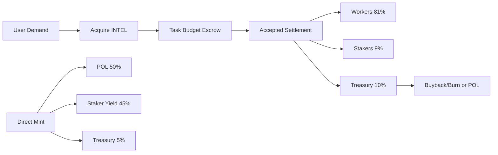

# INTEL Launch Architecture (Speculative Product Reset)

Last updated: 2026-04-18

## Product Position

This is a fresh launch spec, not a migration plan.

- `INTEL` is the native unit for pricing and settling intelligence work.
- Stablecoins are optional on-ramp UX only.
- Legacy stable-point rails and Arc-first settlement are out of launch scope.

## Launch Objective

Make the token market itself discover the price of intelligence by routing demand, supply, and yield through one public asset.

## Core Mechanics

### 1) Task Market

- Buyer acquires `INTEL` (market buy or automatic stable->INTEL convert).
- Buyer escrows task budget in `INTEL`.
- On acceptance, settlement splits:
  - `81%` workers
  - `9%` stakers
  - `10%` treasury

### 2) Staking + Mint

- Stake `INTEL` to receive staking position and mint rights.
- Epoch mint rights are capped:

```text
allowancePerEpoch(wallet) = min(k * sqrt(stakedIntel(wallet)), walletCap, globalCapRemaining)
mintPrice = max(TWAP * (1 + premium), floorPrice) * utilizationMultiplier
```

### 3) Treasury + Liquidity Policy

- Direct mint inflow split target:
  - `50%` protocol-owned liquidity (POL)
  - `45%` staker yield
  - `5%` treasury runway
- Treasury toggles between POL adds and buyback/burn based on utilization + depth conditions.

## Sources and Sinks

### Sources

- Public market buys
- Direct mint (bounded by caps + pricing guards)
- Worker payouts from accepted tasks

### Sinks

- Task escrow and settlement
- Staking locks
- Buyback-and-burn program

## System Diagram



## Blind Spots and Controls

1. Reflexive mint loop.
   - Control: strict epoch caps + utilization premium.
2. Thin-liquidity manipulation.
   - Control: TWAP windows, floor pricing, slippage limits.
3. Demandless emissions.
   - Control: emission policy keyed to accepted-task volume.
4. Fast worker dump pressure.
   - Control: optional vesting tiers and performance multipliers.
5. Mercenary staking churn.
   - Control: cooldown and time-weighted rewards.

## Hard Launch Constraints

1. No stable-denominated settlement in product-facing flows.
2. No IXP/legacy credit terminology in launch UX.
3. No Arc escrow dependency in the launch critical path.
4. No mandatory identity gate for core task posting/claiming.
5. Full-budget settlement or fail; no silent partial payout.

## Immediate Build Priorities

1. Replace stable-point rails in broker APIs with INTEL-native budgeting/settlement.
2. Remove Arc-specific settlement coupling from default flow.
3. Add stake/mint accounting primitives around epoch caps and yield routing.
4. Expose market observability: utilization, realized fee yield, liquidity depth.
