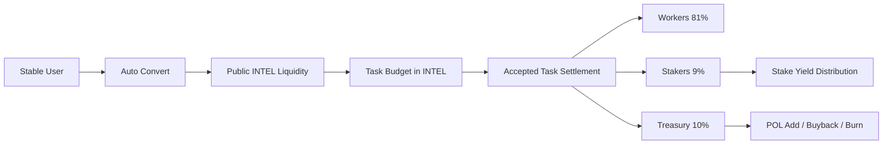

# INTEL Public Market Path (Speculative)

Last updated: 2026-04-18

## Objective

Build a publicly traded token (`INTEL`) that discovers the market price of intelligence by forcing task demand, worker supply, and staking yield to clear through one rail.

This document is intentionally speculative and optimization-first.

## Desync Fixes vs Earlier Token Drafts

1. One rail only: all task settlement clears in `INTEL`.
2. Stablecoins become an entry UX, not a second accounting system.
3. Stake-to-mint remains permissioned by epoch caps, not unlimited mint rights.
4. Rewards route to all stakers pro-rata, not only active minters.
5. Liquidity strategy shifts to protocol-owned depth (POL) first, external LP second.
6. Demand sinks are required before large emissions to avoid pure reflexive inflation.

## Token Sources and Sinks

### Sources

- Direct mint from stables (price-bounded by TWAP + premium)
- Buy on public pools/CEX listings
- Worker rewards from accepted task fees

### Sinks

- Task payments (burn or escrow-to-settle path)
- Staking lock for mint allowance and yield participation
- Buyback-and-burn from treasury policy when demand outpaces supply

## Core Flow



## Blind Spots and Corrective Controls

1. Reflexive mint spiral.
   - Control: epoch mint cap + utilization-weighted premium.
2. Thin-liquidity manipulation.
   - Control: TWAP oracle windows + mint floor + max slippage guard.
3. Emission without demand.
   - Control: emissions keyed to accepted-task fee volume, not wall-clock only.
4. Worker extraction with instant sell pressure.
   - Control: optional vesting tranches and performance-weighted unlock boosts.
5. Staker mercenary rotation.
   - Control: cooldown for unstake and time-weighted reward multiplier.
6. Price discovery noise from small tasks.
   - Control: publish volume-weighted intelligence price index by task class.

## Net Path to Public Token Discovery

### Phase 1: Internal-External Bridge

- Keep current broker `IXP` loop running.
- Mirror all flows into shadow `INTEL` accounting.
- Publish weekly synthetic `INTEL` clearing metrics (volume, realized fee yield, implied unit price).

### Phase 2: Public Rail Activation

- Turn on mandatory `INTEL` settlement for new tasks.
- Keep auto-convert from stables as default UX.
- Enable stake-to-mint with conservative epoch caps.

### Phase 3: Market-Native Discovery

- Expand publicly traded liquidity depth.
- Route treasury policy between POL adds vs buyback/burn using utilization thresholds.
- Use onchain + broker settlement data to publish canonical "price of intelligence" dashboards.

## Controller Defaults (Speculative)

```text
taskFeeSplit = 81/9/10 (workers/stakers/treasury)
mintInflowSplit = 50/45/5 (POL/stakers/treasury)
allowancePerEpoch(wallet) = min(k * sqrt(stakedIntel), walletCap, globalCapRemaining)
mintPrice = max(TWAP * (1 + premium), floorPrice) * utilizationMultiplier
```

## Decision Log Needed Before Coding

1. Burn-on-pay vs escrow-on-pay semantics for task execution.
2. Vesting schedule for worker payouts and its exemption rules.
3. Buyback policy function (continuous vs epoch batch).
4. Index methodology for intelligence price publication.
